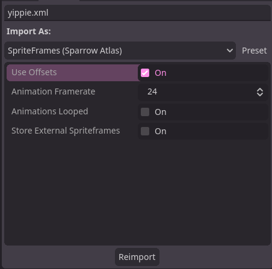

#  godot_sparrow

A [Godot](https://godotengine.org) addon that adds a ResourceImporter for the [Sparrow Texture Atlas XML Format](https://wiki.sparrow-framework.org/manual/textures_and_images).

## Usage

Just add the .xml file relative to your image into your project and it should be imported automatically as SpriteFrames that are usable in any AnimatedSprite (2D or 3D).

### Import Properties

- use_offsets
    Simply toggles whether or not frameX, frameY, frameWidth, and frameHeight are used in generating the SpriteFrames.
- animation_framerate
    Framerate (or FPS) all animations are exported in by default.
- animations_looped
    Whether or not animations are looped by default.
- store_external_spriteframes
    Allows you to store the generated SpriteFrames in project with your .xml to change certain things like adding individual animation framerate differences.
